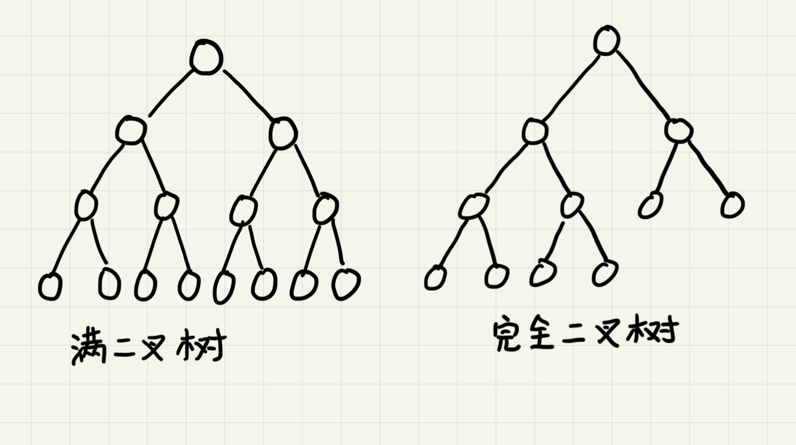
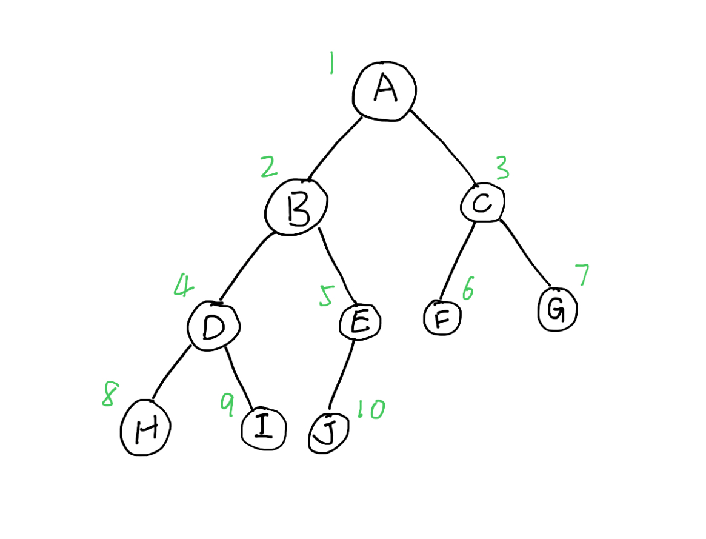

# 二叉树

树由一系列结点连接而成，连接相邻结点的叫做父子关系。

如图，`A`是`B`的父结点，`B`是`A`的子结点。没有父结点的称为根结点(`E`)。有相同父结点的互为兄弟结点(`B`, `C`, `D`)。没有子结点的称为叶子结点(如`I`和`J`)。

`结点的高度` = 该结点到叶子结点的最长路径

    A到G路径长度(边的数量)为2，因此A的高度为2

`结点的深度` = 根结点到该结点的最长路径

    A到E的路径长为1，因此A的深度为1

`结点的层数` = 结点的深度+1

    根结点算第一层，因此结点的层数就是深度+1

`树的高度` = 根结点的高度

## 二叉树

每个结点最多只有两个子结点的树为二叉树。

`满二叉树`：  
* 叶子结点都在树的最底层
* 除了叶子结点都有2个子结点

`完全二叉树`：
* 叶子结点全都在最下面2层
* 最底层的叶子结点全部靠左分布
* 除了最底层，其他层的结点个数达到最大

## 二叉树的存储

链式存储：每个结点包含左右子结点的指针和本结点的值

顺序存储：结点值存放在数组中

顺序存储规则如下：

根结点存储在下标为1的位置上，左子结点存在`2*1=2`的位置，右子结点存在`2*1+1=3`的位置。对任一存储在数组下标为`index`的结点，其左子结点存储在`2*index`的位置，右子结点存储在`2*index+1`的位置。

由此，上图的二叉树用顺序存储的方式得到的数组为`{*, A, B, C, D, E, F, G, H, I, J}`，可以发现，该存储方式会浪费一个存储空间。

如果D子树不存在，可以得到数组`{*, A, B, C, *, E, F, G, *, *, J}`，这时候会多出三个位置不存储数据。因此，当顺序存储的树不是完全二叉树的情况下，可能会浪费较多的数组空间。

## 二叉查找树

对树中的任一结点，其左子树中的每个结点的值都小于这个结点的值，而右子树结点的值都大于这个结点的值。

### 查找

取根结点对比，如果相等则返回，如果目标值比较小则在左子树中递归查找，否则在右子树中递归查找。

### 插入

新插入的结点，一般在叶子结点上。从根结点开始比较，如果要插入的数据比当前结点大且右子树为空，直接插入即可。若非空则递归右子树。左子树的操作同理。

### 删除

如果要删除的结点没有子结点，直接从父结点中删除该结点即可。

如果删除的结点只有一个子结点，将父结点中指向该结点的指针指向该结点的子结点。

如果要删除的结点右两个结点。找到右子树中的最小结点，替换到要删除的结点上，然后再删除那个最小结点(他可能有右子结点)。

### 关于重复数据

一般将重复的数据放到右子树中，查找数据的时候要一直查找到叶子结点。删除结点的时候也要依次删除。

## 性能分析

由于二叉树要通过父节点找出子节点来完成遍历，所以一个节点需要遍历两次，遍历时间复杂度为`O(n)`。

在普通二叉树中查找数据，由于数据分布无规律，最坏情况需要遍历整个二叉树，时间复杂度为`O(n)`。

二叉查找树的查找增删查时间复杂度为`O(logn)`。

## 必知必会

实现一个二叉查找树，并且支持插入、删除、查找操作

实现查找二叉查找树中某个节点的后继、前驱节点

实现二叉树前、中、后序以及按层遍历
