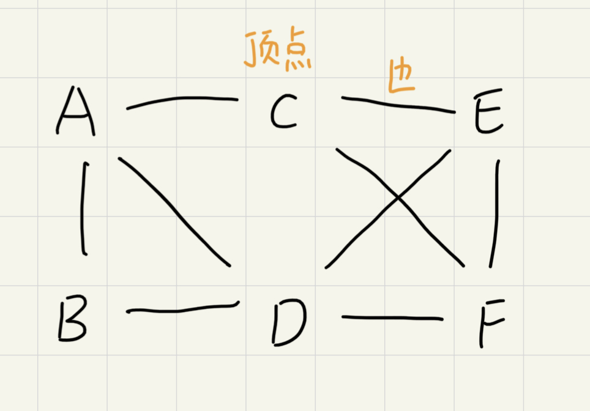
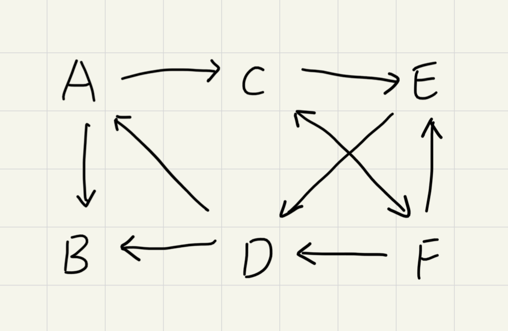
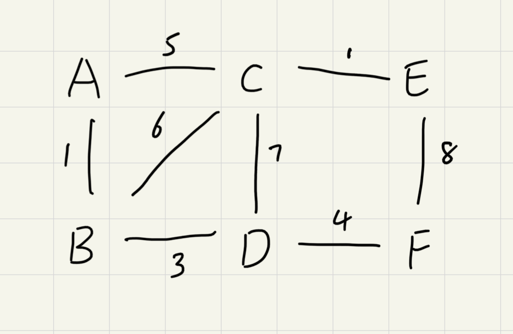
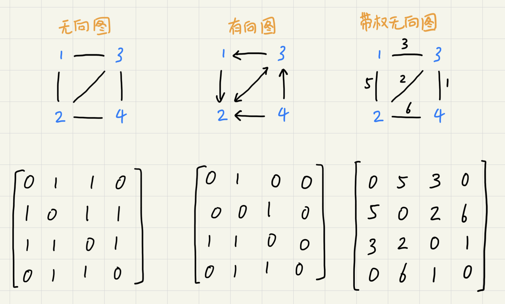
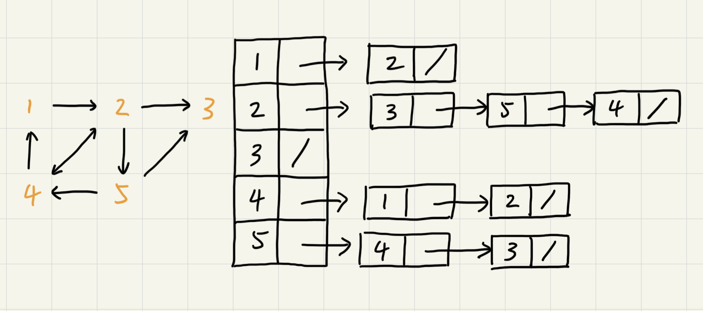
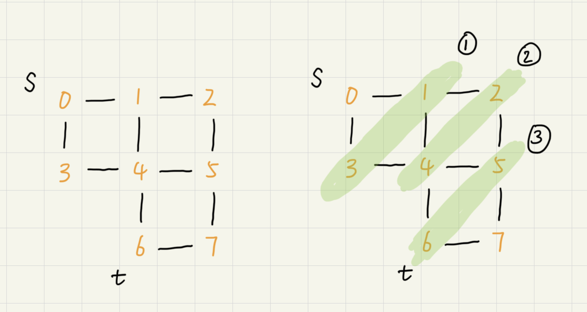
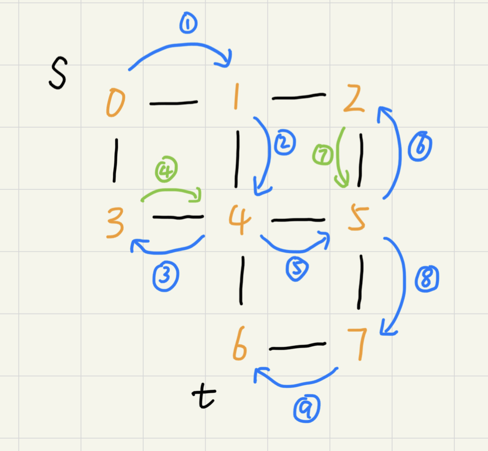

# 图

除了之前涉及到的树，图（Graph）也是非线性表数据结构。

树中的元素叫节点，图中的元素称为顶点（vertex）。图中的顶点可与任意其他顶点建立连接关系，这种关系称为边（edge）。



跟某一顶点相连接的边的条数称为顶点的度（degree）。

在图中引入方向后就变成了有向图。其中顶点入度（in-degree）表示由多少条边指向改顶点。顶点的出度（out-degree）表示由多少条边是以这个顶点为起点指向其他顶点。



如果给图中的度都加上权重（weight）就成了带权图（weighted graph）。



## 邻接矩阵存储方法

图最直观的存储方法就是邻接矩阵（Adjacency Matrix）。这种方法底层依赖一个二维数组。

对于无向图，如果顶点 i 和顶点 j 之间有边，就将`A[i][j]`标记为 1；对于无向图如果顶点 i 有边指向顶点 j 才将`A[i][j]`标记为 1，如果由 j 指向 i 则将`A[j][i]`标记为 1。



对于无向图来说，邻接矩阵存储会比较浪费空间，因为`A[i][j]`和`A[j][i]`表示的同一个度，这就浪费了一半的数组空间。相对的，邻接矩阵存储方法简单、直接，在获取两个顶点的关系时非常高效还方便计算。

## 邻接表存储方法

相比于邻接矩阵，邻接表的存储方法空间利用率会更高。邻接表类似散列表，每个顶点对应一条链表，链表中存储的是与这个顶点相连接的其他顶点。



邻接表中查询两个顶点的关系不像邻接矩阵那么高效，需要遍历链表。和散列表一样，邻接表中的链表也可以用跳表或者红黑树优化。

## 搜索算法

图中的搜索算法可以理解为从其中一个顶点出发到顶一个顶点的路径。具体方法由很多，比如最简单的深度优先、广度优先搜索，还有`A*`，`IDA*`等启发式搜索算法。

### 广度优先搜索（BFS）

广度优先搜索（Breadth-First-Search）是一种层层推进的搜索策略，即先查找离起始顶点最近的，然后是次近的，依次往外搜索。



代码实现如下：

```Golang

```

其中队列用来存储即将遍历的下一层顶点，一个数组用来存储已经入队过的顶点，一个数组用来存储当前遍历路径下某个顶点的前一个顶点。

由于广度优先是按层遍历的。队列的使用可以确保在遍历完一层之后才开始遍历下一层。*存储已经入队过的顶点*的数组是为了防止节点重复遍历导致死循环。*存储当前遍历路径下某个顶点的前一个顶点*的数组是为了保存当前的路径（一般 bfs 的结果就是最短路径）。

#### 性能分析

最坏情况下，终止顶点离起始顶点很远需要遍历完整个图才能找到。这是每个顶点都要进出一遍队列，每个便也都会被访问一次，所以时间复杂度为`O(E+V)`，其中 E 表示边的个数，V 表示顶点个数。

广度优先搜索算法的空间消耗主要在辅助变量上，这些变量的大小都不会超过顶点的个数，空间复杂度是`O(V)`。

### 深度优先搜索（DFS）

深度优先搜索（Depth-First-Search）用的是回溯思想。这种思想解决问题的过程，非常适合用递归来实现。具体细节参考[回溯思想——暂时还没写好](#图)



#### 性能分析

由上面的流程图可以看出，每条边最多会被访问两遍，一次是遍历，一次是回溯。所以，图上的深度优先搜索算法的时间复杂度是`O(E)`，E 表示边的个数。

深度优先搜索算法的消耗内存主要是数组和递归调用栈。数组的大小跟顶点的个数 V 成正比，递归调用站的最大深度不会超过顶点的个数，所以总的空间复杂度就是`O(V)`。

## 必知必会

实现有向图、无向图、有权图、无权图的邻接矩阵和邻接表表示方法

实现图的深度优先搜索、广度优先搜索
