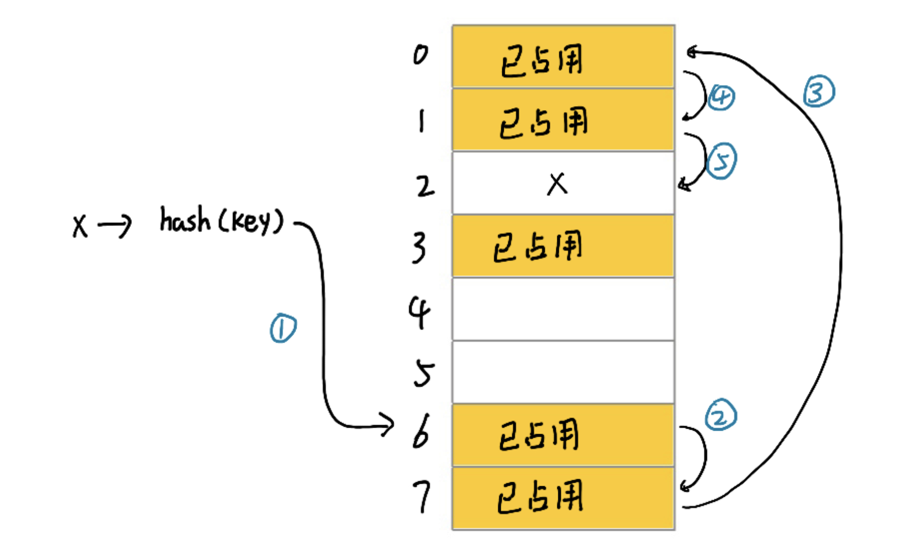
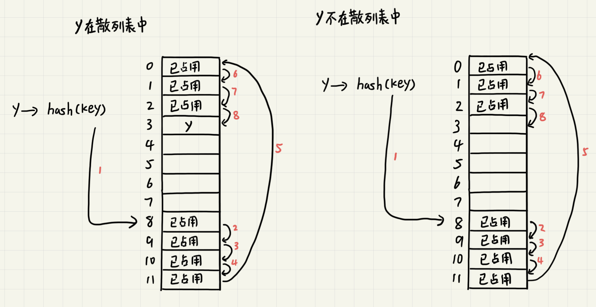

# 散列表

散列表英文叫“Hash Table”，平常也叫“哈希表”。散列表利用的是数组支持按照下标随机访问数据的特性，所以散列表其实就是数组的一种扩展，有数组演化而来。

散列表通过散列函数将键值映射为下标，然后将数据存储在数组中对应下标的位置。当按照键值查找元素的时候，用同样的散列函数将键值转化为数组下标，从对应的数组下标的位置取出数据。

## 散列函数

散列函数在散列表中至关重要，通常该函数定义为`hash(key)`，其中`key`表示元素的键值，`hash(key)`的值表示经过散列函数计算得到的散列值。

散列函数有三点基本要求：

1. 散列函数计算得到的散列值是一个非负数

    这是因为数组的下标从`0`开始。

2. 相同的键值经计算后得到的散列值是一样的

    如果两次散列的结果不一样，散列表就无法正常工作。

3. 不同的键值计算后得到的散列值不一样

    这是理想情况下的要求。在现实生活中几乎找不到一个*不同的键值对应的散列值都不一样*的散列函数。即使是广为使用的`MD5`、`SHA`、`CRC`等哈希算法也无法完全避免这种散列冲突。

## 散列冲突

再好的散列函数也无法避免散列冲突。常用的散列冲突解决方法有两类，开放寻址法（open addressing）和链表法（chaining）。

### 开放寻址法

开放寻址法的核心思想是，如果出现了散列冲突，就重新探测一个空闲位置。

**线性探测**是比较简单的一种探测方法。在插入数据的过程中，如果某个键值计算后的散列值对应的位置已被占用，就从当前位置开始往后依次查找到空闲位置为止。

查找和插入的时候类似。从计算出的散列值对应的位置开始往后查找直到遇到未被占用的空间（表示没有要查找的值）或者找到对应的值。

由于在查找的时候，未占用位置会终止查找，所以在删除数据的时候如果知识简单地只删除对应的数据会导致查找失效。所以一般不删除数据而是标记为`deleted`以确保查找正常。

可见，线性探测存在很大的问题。当散列表中插入的数据越来越多时，散列冲突发生的可能性就会越来越大，空闲位置会越来越少，线性探测的时间就会越来越久。极端情况下可能需要探测整个散列表，所以最坏情况下时间复杂度为`O(n)`。同理，删除的时候最坏时间复杂度为`O(n)`。

除了线性探测，还有另外两种比较经典的探测方法，二次探测（Quadratic probing）和双重散列（Double hashing）。但不管采用哪种探测方法，当散列表中空闲位置不多的时候，散列冲突的概率就会大大提高。为了尽可能保证散列表的操作效率，一般情况下会尽量保证散列表中有一定比例的空槽位。装载因子用来表示空位的多少。`散列表的装载因子 = 填入表中的元素个数/散列表的长度`，装载因子越大，说明空闲位置越少，冲突越多，散列表的性能会下降。

### 链表法

链表法是一种更加常用的散列冲突解决方法。相比开放寻址法，它要简单得多。图中的散列表，每个buckets（桶）或者叫“槽（slot）”会对应一条链表，所有散列值相同的元素都放到相同槽位对应的链表中。

当插入的时候，只需要通过散列函数计算出对应的散列操作，将其插入到对应的链表中，因此插入的时间复杂度为`O(1)`。当查找、删除一个元素时，同样通过散列函数计算出对应的槽位，但链表部分查找的时间复杂度为`O(k)`。其中`k`为链表的长度，理想情况下`k=数据量/buckets数量`。所以查找的时间复杂度为`O(k)`，更均匀的散列和足够数量的buckets可以进一步降低k。

