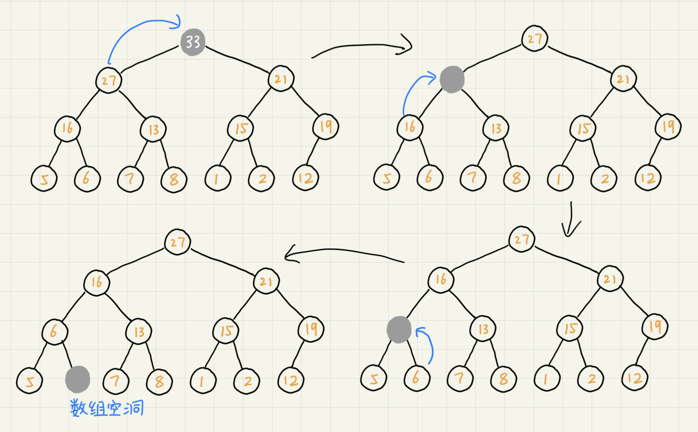

# 堆

堆（heap）是一种特殊的树，它的应用场景很多，最经典的莫过于堆排序。堆排序是一种原地的、时间复杂度为`O(nlogn)`的排序算法。堆需要满足以下的条件：

* 堆是一个完全二叉树
* 堆中的每一个节点都必须大于等于（或小于等于）其子树中每个节点的值

对于每个节点的值都大于等于子树中每个节点值得堆，我们叫做“大顶堆”。对于每个节点的值都小于等于子树中每个节点的堆叫做“小顶堆”。

## 如何实现一个堆

完全二叉树比较适合用数组来存储，这很节省存储空间。

可以看到，数组中下标为`i`的节点的左子节点，就是下标为`i*2`的节点，右子节点就是下标为`i*2+1`的节点，父节点就是下标为`i/2`的节点。

### 往堆中插入一个元素

往堆中插入数据后需要重新堆化来使树满足堆的特性。堆化实际上有两种，从下往上和从上往下。这里介绍从下往上的堆化方法。

让新插入的节点与父节点对比大小。如果不满足子节点小于等于父节点的大小关系，我们就互换两个节点。一直重复这个过程，直到父子节点之间满足堆的特性。

### 删除堆顶元素

通过堆的定义可知，堆顶的元素或是最大或是最小。删除堆顶之后需要把第二大的元素放到堆顶，而第二大元素肯定会出现在左右子节点中。然后再迭代删除第二大节点，以此类推直到叶子节点被删除。但这种情况会导致数组出现空位，即出现不存放数据的位置，如下图。

可以把最后一个节点放到堆顶，利用同样的父子结点对比方法，对于不满足父子节点大小关系的，互换两个节点，并且重复进行这个过程，直到父子节点之间满足大小关系位置。这就是**从上往下的堆化方法**。因为操作过程中移除的是数组的最后一个元素，而在堆化过程中都是交换操作，数组中不会出现空位，所这种方法堆化之后的堆仍然满足完全二叉树的特性。

对于一个包含n个节点的完全二叉树，树的高度不会超过$log_2n$。堆化的过程是顺着节点所在的路径比较交换的，所以堆化的时间复杂度跟树的高度成正比，也就是`O(logn)`。插入数据和删除堆顶元素的主要逻辑就是堆化，所以，往堆中插入元素和删除堆顶元素的时间复杂度都是`O(logn)`。

## 堆排序

堆排序是时间复杂度稳定为`O(nlogn)`的原地排序算法（它的交换次数比快排要多），其流程大致分为建堆和排序两个步骤。

### 建堆

1. 从下往上的建堆方法

    尽管数组中包含n个数据，但是我们可以假设，起初堆中只包含一个数据，就是下标为1的数据。然后插入下标2到n的元素从而形成一个堆。

2. 从上往下的建堆方法

    叶子节点往下堆化只能跟自己比较，所以直接从最后一个非叶子节点开始依次堆化即可。

第二种方法的建堆流程如图。

#### 建堆的时间复杂度

因为叶子节点不需要堆化，所以需要堆化的节点从倒数第二层开始。每个节点堆化的过程中，需要比较和交换的节点个数跟节点高度成正比。如图，将每个节点的高度求和就是建堆的时间复杂度。

对非叶子节点的高度求和，公式为

$$
S_1 = 1*h + 2^1*(h-1) + 2^2*(h-2) + 2^3*(h-3)+...+2^{h-1}*1
$$

简化得高度和为

$$
S = 2^{h+1}-h-2
$$

因为$h=log_2n$，带入后得到建堆的时间复杂度为`O(n)`。

### 排序

建堆结束后，数组中的数据已经是按照大顶堆的特性来组织的。数组中的第一个元素就是堆顶，也就是最大的元素。把堆顶元素后宿主最后一个元素交换，这时最大的元素就在下标为n的位置。

然后在对除最后一个元素以外的数组做堆化，因为最大元素被换到了最后，剩余的部分破坏了堆的特性。重新堆化后的下标1到n-1的数组又是一个大顶堆，此时的堆顶就是整个数组的第二大元素，然后互换堆顶元素和n-1下标位置的元素，再重新堆化1到n-1的数组...直到堆中只剩下一个元素，排序完成。

### 堆排序性能分析

堆排序是原地排序算法，空间复杂度为`O(1)`。

时间复杂度由两部分组成，建堆时间复杂度为`O(n)`，排序部分时间复杂度为`O(nlogn)`（需要做n次堆化）。因此总的时间复杂度为`O(nlogn)`。

由于数据交换过程中会破坏数组原来的元素顺序，因此堆排序不是稳定的排序算法。

## 必知必会

实现一个小顶堆、大顶堆、优先级队列

实现堆排序

利用优先级队列合并K个有序数组

求一组动态数据集合的前K大的元素

