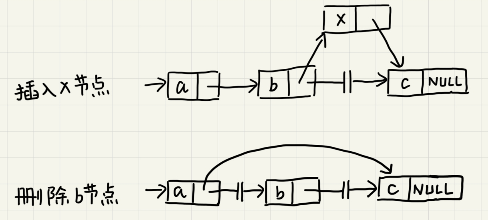

# 链表

数组需要一块连续的内存空间来存储，对内存要求比较高。而链表恰恰相反，它并不需要一块连续的内存空间，它通过“指针”将一组零散的内存块串联起来使用。

链表中零散的内存块称为节点，为了将所有的节点串联起来，每个链表的节点除了存储数据之外还需要记录链上的下一个节点的地址。这个记录下个节点地址的指针称为**后继指针next**。

链表中的第一个节点称为**头节点**，最后一个节点叫做**尾节点**。其中，头节点用来记录链表的基地址，可以由此遍历得到整条链表。而尾节点特殊的地方在于指针不是指向下一个节点，而是指向一个**空地址NULL**，表示这是链表上的最后一个节点。

## 删除和插入

与数组一样，链表也支持数据的查找、插入和删除操作。

在进行数组的插入、删除操作时，为了保持内存数据的连续性，需要做大量的数据搬移，所以时间复杂度时`O(n)`。而在链表中插入或删除一个数据并不需要保持内存的连续性和搬移节点，因为链表的存储空间本身就不是连续的。针对链表的插入和删除操作，只需要考虑相邻节点的指针改变，所以对应的时间复杂度时`O(1)`。

## 单链表

链表的删除和插入操作时间复杂度是`O(1)`。但代价是对于数据的随机访问，链表没有数组那么高效。因为链表的数据并非连续存储的，所以无法像数组那样**根据首地址和下标通过寻址公式直接计算出对应的内存地址**，而是需要根据指针一个节点一个节点地依次遍历直到找到相应的节点，时间复杂度为`O(n)`。

## 循环链表

循环链表是一种特殊的单链表。循环链表跟单链表的区别在于循环链表的尾节点指向头节点而不是指向NULL。

和单链表相比，循环链表的优点是从链尾到链头比较方便。当要处理的数据具有环型结构特点时，就特别适合采用循环链表。比如著名的[约瑟夫问题](https://zh.wikipedia.org/zh-hans/%E7%BA%A6%E7%91%9F%E5%A4%AB%E6%96%AF%E9%97%AE%E9%A2%98)。尽管用单链表也可以实现，但是用循环链表实现的话代码会简洁很多。

## 双向链表

双向链表支持两个方向，每个节点不止有一个后继指针next指向后面的节点，还有一个前驱指针prev指向前面的节点。双向链表需要额外的两个空间来存储后继节点和前驱节点的地址。所以，如果存储同样多的数据，双向链表要比单链表占用更多的内存空间。但支持双向遍历也带来了更高的操作灵活性，使得双向链表可以在`O(1)`时间复杂度的情况下找到前驱节点。正式这样的特点，也使双向链表在某些情况下的插入、删除等操作都要比单链表更加高效。

## 数组与链表的对比

## 必知必会

实现单链表、循环链表、双向链表，支持增删操作

实现单链表反转

实现两个有序的链表合并为一个有序链表

实现求链表的中间节点

