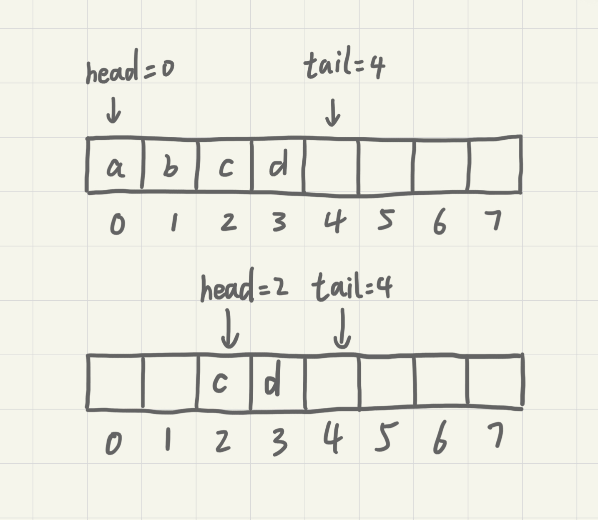
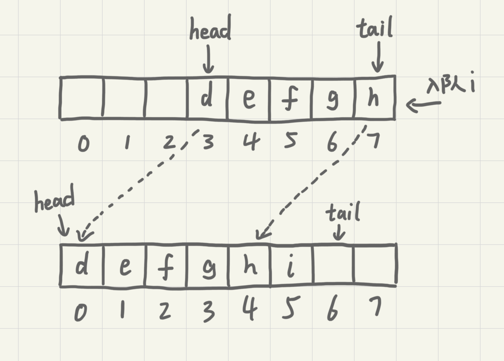
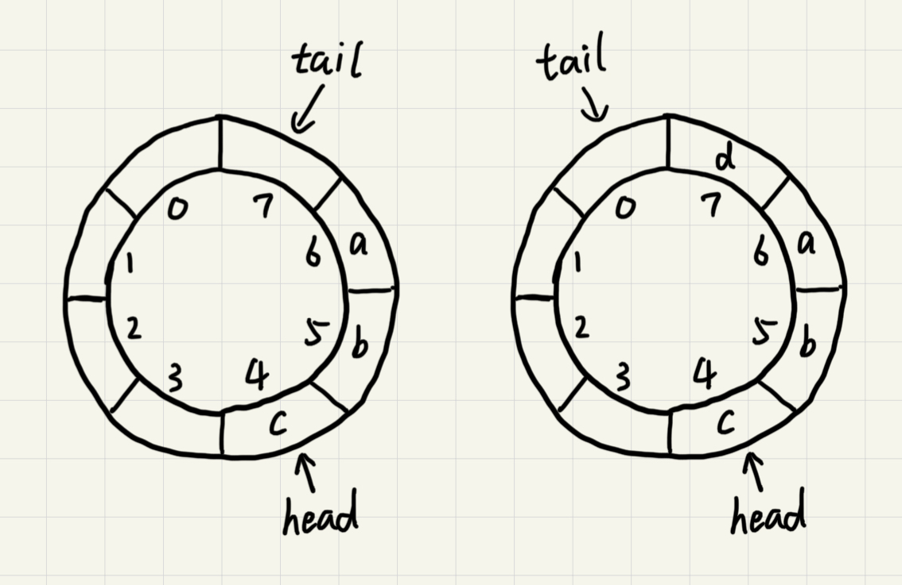

# 队列

队列跟栈非常相似，是一种操作受限的线性表数据结构，支持的操作也有限，最基本的操作也是两个：**入队(enqueue)**，放一个数据到队列尾部；**出队(dequeue)**，从队列头部取一个元素。

## 顺序队列和链式队列

用数组实现的队列叫**顺序队列**，用链表实现的**链式队列**。

```go
// 用数组实现的队列
type ArrayQueue struct {
    // 数组：items，数组大小：n
	items []string
	n     int
    // head表示队头的下标，tail表示队尾的下标
	head  int
	tail  int
}

func NewArrayQueue(capacity int) *ArrayQueue {
	return &ArrayQueue{
		items: make([]string, capacity),
		n:     capacity,
		head:  0,
		tail:  0,
	}
}

// 入队
func (aq *ArrayQueue) Enqueue(item string) bool {
	// tail == n 表示队列已满
	if aq.tail == aq.n {
		return false
	}
	aq.items[aq.tail] = item
	aq.tail++
	return true
}

// 出队
func (aq *ArrayQueue) Dequeue() string {
	// head == tail 表示队列为空
	if aq.head == aq.tail {
		return ""
	}
	ret := aq.items[aq.head]
	aq.head++
	return ret
}
```

对于栈来说，我们只需要一个栈顶指针就可以了。但是队列需要两个指针：head和tail。



从上图中可以发现，随着不停进行入队出队，head和tail会持续往后移。当tail移动到最右边，即使数组还有空闲空间，也无法继续往队列中添加数据了。这时候就需要做数据搬移，保持出队操作不变，只在入队的时候做搬移操作。

```GO
// 入队
func (aq *ArrayQueue) Enqueue(item string) bool {
	// tail == n 表示队列末没有空间了
	if aq.tail == aq.n {
		// head == 0 并且 tail == 0，表示队列已满
		if aq.head == 0 {
			return false
		}
		// 数据搬移
		for i := aq.head; i < aq.tail; i++ {
			aq.items[i-aq.head] = aq.items[i]
		}
		// 搬移后更新head和tail
		aq.tail -= aq.head
		aq.head = 0
	}
	aq.items[aq.tail] = item
	aq.tail++
	return true
}
```

从更改后的代码中可以看出，当队列的tail指针移动到数组的最右边后，如果新数据入队九江head到tail之间的数据整体搬移到数组中0到tail-head的位置。



平常的入队操作的时间复杂度仍然是O(1)，触发搬移的时候搬移的数据量为K(K<=n)，最差时间复杂度为O(n)，均摊到平常入队操作中计得平均得时间复杂度为O(1)。

```GO
type LinkQueue struct {
	head *node
	tail *node
}

func (q *LinkQueue) Enqueue(value string) {
	newNode := &node{value: value}
	if q.head == nil {
		q.head = newNode
	} else {
		q.tail.next = newNode
	}
	q.tail = newNode
}

func (q *LinkQueue) Dequeue() string {
	if q.head == nil {
		return ""
	}
	value := q.head.value
	q.head = q.head.next
	if q.head == nil {
		q.tail = nil
	}
	return value
}
```

链表实现的队列中没有固定空间大小，入队与出队的时间复杂度均为O(1)。

## 循环队列

在用数组实现的队列中，当tail==n时会有数据搬移操作，这样入队操作性能就会收到影响。使用循环队列可以避免搬移从而提升性能。



图中的循环队列大小为8，当继续入队一个数据的时候，tial不由原来的7更新为8，而是变成0回到了数组的头部，使得队列首尾相连。

这样的方法成功地避免了数据搬移，但是队列空和队列满的判断条件就和原来不一样了。在非循环的顺序队列中，队列的判断条件是`tail==n`，队列空的判断条件是`head==tail`。

对于循环队列，队列空的条件仍然是`head==tail`。在上图中，队列会在一直入队直到tail==3的时候达到队满，即队列满的条件为`(tail+1)%n==head`。此时tail是不存储数据的，也就是说循环队列会浪费一个数组的存储空间。

```GO
// 循环队列
type CycleQueue struct {
	items []string
	n     int
	head  int
	tail  int
}

func NewCycleQueue(capacity int) *CycleQueue {
	return &CycleQueue{
		items: make([]string, capacity),
		n:     capacity,
		head:  0,
		tail:  0,
	}
}

func (cq *CycleQueue) Enqueue(item string) bool {
	if (cq.tail+1)%cq.n == cq.head {
		return false
	}
	cq.items[cq.tail] = item
	cq.tail = (cq.tail + 1) % cq.n
	return true
}

func (cq *CycleQueue) Dequeue() (string, bool) {
	if cq.head == cq.tail {
		return "", false
	}
	item := cq.items[cq.head]
	cq.head = (cq.head + 1) % cq.n
	return item, true
}
```

## 阻塞队列和并发队列

**阻塞队列**在队列的基础上增加了阻塞操作。简单来说，就是在队列为空的时候，从队头取数据会被阻塞。因为此时还有没有数据可取，直到队列中有了数据才能返回；如果队列已满，那么插入插入数据的操作就会被阻塞，直到队列中有空闲位置后再插入数据。这其实就是一个**生产者-消费者模型**。

这种基于阻塞队列实现的“生产者-消费者模型”可以有效地协调生产和消费的速度。当生产者生产数据的速度过快，消费者来不及消费时，存储数据的队列很快就满。这个时候，生产者就阻塞等待，直到消费者消费了数据，生产者才会被唤醒继续生产。

而且不仅如此，基于阻塞队列，还可以通过协调生产者和消费者的个数，来提高数据的处理效率。比如可以多配置几个消费者来应对一个生产者。

线程安全的队列称为**并发队列**。最简单直接的实现方法是直接在入队和出队的方法上加锁，但是锁粒度大并发度会比较低，同一时刻仅允许一个存或者取操作。实际上，基于数组的循环队列，利用`CAS`原子操作可以实现非常高效的并发队列。这也是循环队列比链式队列应用更加广泛的原因。


