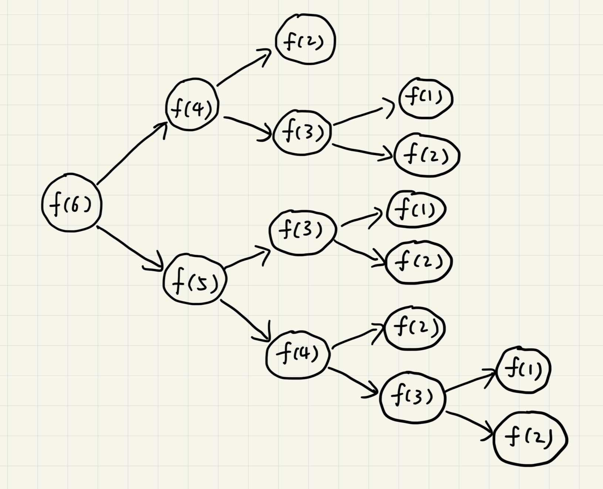

# 递归

可以用递归的解决的问题需同时满足以下三个条件：

1. 一个问题的解可以分解为几个子问题的解
2. 这个问题与分解之后的子问题，除了数据规模不同，求解思路完全相同，求解思路完全相同
3. 存在递归终止条件

## 递归代码的编写

递归最关键的是**写出递归公式，找到终止条件**，然后将公式转换为代码。

假设有n个台阶，每次可跨过1个或者2个台阶，这n个台阶有多少种走法？如果有7个台阶，可以2，2，2，1这样子走完，也可以1，2，1，1，2这样子走完。实际上，可以根据第一部的走法把所有走法分为两类，第一类是第一步走了1个台阶，另一类是第一步走了2个台阶。多以n个台阶的走法就等于`先走1阶后，n-1个台阶的走法`加上`先走2阶后，n-2个台阶的走法`。公式表示为`f(n) = f(n-1)+f(n-2)`。

当只有一个台阶时，我们不需要继续递归，就只有一种走法。但是`f(1)=1`并不能作为唯一的终止条件，因为`f(2)=f(1)+f(0)`无法求解。所以终止条件为`f(1)=1`和`f(2)=2`。

## 堆栈溢出

每个函数的调用都会将临时变量封装成栈帧压入内存栈，等函数执行完成返回才出栈。系统栈或者虚拟机栈空间一般都不大。如果递归求解的数据规模很大，调用层次很深，一直压入栈就会有堆栈溢出的风险。

可以通过限制递归调用的最大深度来一定程度上解决这个问题，因为最大允许的递归深度跟当前线程剩余的栈空间大小有关，事先无法计算。而实时计算的代码过于复杂，会影响代码的可读性。所以如果最大深度比较小，如10、50，就可以用这种方法，否则这种方法并不是很实用。

## 重复计算

在`f(n)=f(n-1)+f(n-2)`中，`f(5)=f(4)+f(3)`，`f(4)=f(3)+f(2)`。可以发现`f(3)`会被重复计算很多次。

为了避免这个问题，可以通过一个数据结构（比如散列表）来保存已经求结过的`f(k)`。

## 其他问题

除了重复计算和堆栈溢出，递归还有很对其他问题。

在时间复杂度上，递归代码里多了很多函数调用。当这些函数调用的数量较大时，就会累计出可观的时间成本。

在空间复杂度上，因为递归调用一次就会在内存栈中保存一次现场数据，所以在分析递归代码空间复杂度时需要额外考虑这部分的开销。

## 必知必会

实现斐波那契数列求值`f(n)=f(n-1)+f(n-2)`

实现求阶乘`n!`

实现一组数据集合的全排列
