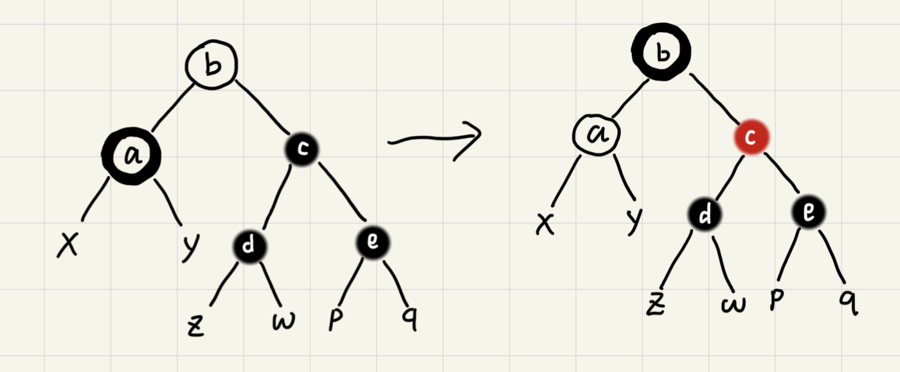

# 红黑树

二叉查找树是最常用的一种二叉树，支持快速的插入、删除、查找操作，理想情况下时间复杂度为`O(logn)`。但是在频繁的更新过程中，可能会出现树的高度远大于理想情况导致二叉树退化为链表，复杂度为`O(n)`。为了解决复杂度退化的问题，需要设计一种平衡二叉查找树，而平衡二叉查找树中最常用的就是红黑树。

## 什么是平衡二叉查找树？

`平衡二叉树`的严格定义：二叉树中任意一节点左右子树的高度相差不能大于1。

    根据此定义，完全二叉树、满二叉树都是平衡二叉树。而非完全二叉树也可能是平衡二叉树

`平衡二叉查找树`不仅满足上面平衡二叉树的定义，还满足二叉查找树的特点。最先被发明的平衡二叉查找树是[AVL树](https://zh.wikipedia.org/zh-hans/AVL%E6%A0%91)，它严格符合平衡二叉查找树的定义，即任何节点的左右子树高度差不超过1，是一种高度平衡的二叉查找树。

平衡二叉树的初衷是解决复杂度退化的问题。因此并不是所有解决方案都像AVL树那样高度平衡。红黑树从根节点到各个子结点的最长路径有可能会比最短路径大1倍。但只要整棵“树”左右比较“对称”、“平衡”就能让整棵树的高度相对低一些，相应的插入、删除、查找等操作效率不至于退化太严重。

## 红黑树的定义

红黑树中的节点，一类被标记为黑色，一类被标记为红色。除此之外，一颗红黑树还需要满足以下的要求：

* 根节点是黑色的；
* 每个叶子节点都是黑色的空节点，也就是说叶子节点不存储数据；
* 任何相邻的节点都不能同时为红色，也就是说红色节点是被黑色节点隔开的；
* 对于任一节点，从该节点到达其可达叶子节点的所有路径，都包含相同数目的黑色节点。

其中第二点是为了简化代码实现。以下是两个红黑树图例。

## 红黑树的平衡性

一棵高度平衡的二叉树的高度大约是`logn`（以2为底n的对数）。因此红黑树的平衡性如何可以通过计算高度来评估。

如果将树中的红色节点从红黑树中去掉，有些节点就没有父节点了。将原来的祖父节点作为“没有父节点的节点”新的父节点。原来的二叉树就变成了四叉树。

根据红黑树定义中“`对于任一节点，从该节点到达其可达叶子节点的所有路径，都包含相同数目的黑色节点`”，这棵四叉“黑树”每层中的节点的高度都是一致的，如果将“多余”的节点下移就可以将四叉树变成完全二叉树。而完全二叉树的高度近似`logn`，因此四叉“黑树”的高度是小于`logn`的。

根据`任何相邻的节点都不能同时为红色，也就是说红色节点是被黑色节点隔开的`，每有一个红色节点就相应的要有一个黑色节点将它跟其他红色节点隔开。而红黑树中“黑树”部分的最长路径不超过`logn`，加入红色节点后的红黑树高度不超过`2*logn`。也就是说红黑树的高度近似`2*logn`，相比高度平衡的AVL树仅大了一倍，在性能上下降的并不多。

## 平衡性调整

在删除和插入过程中，肯能会破坏红黑树定义中的两点：

* 任何相邻的节点都不能同时为红色，也就是说红色节点是被黑色节点隔开的。
* 对于任一节点，从该节点到达其可达叶子节点的所有路径，都包含相同数目的黑色节点。

这时候就需要通过一些操作来进行调整以满足红黑树的定义。这就是左旋（rotate left）、右旋（rotate right）。

## 插入操作的平衡性调整

`红黑树规定插入的节点必须是红色的`。而且，二叉查找树中新插入的节点都是放在叶子节点上的。

* 如果插入节点的父节点是黑色的，直接插入即可；
* 如果插入的是根节点，将节点颜色变成黑色即可。

初次之外的操作都需要调整，调整操作包括左右旋和改变颜色。

红黑树的平衡性调整是一个迭代的过程。正在被处理的称为“`关注节点`”，关注节点随迭代变化，最开始的关注节点就是要插入的节点。

### CASE 1：关注节点的叔节点是红色的

该情况调整如下：

1. 将`关注节点的父节点`、`关注节点的叔节点`设置成黑色；

2. 将`关注节点的祖父节点`设置成红色；

3. 关注节点变成当前关注节点的祖父节点；

4. 迭代到[CASE 2](#case-2关注节点的叔节点是黑色关注节点是父节点的右子节点)或者[CASE 3](#case-3关注节点的叔节点是黑色关注节点是父节点的左子节点)。

### CASE 2：关注节点的叔节点是黑色，关注节点是父节点的右子节点

该情况调整如下：

1. 关注节点变成当前关注节点的父节点；

2. 围绕关注节点做左旋；

3. 迭代到[CASE 3](#case-3关注节点的叔节点是黑色关注节点是父节点的左子节点)。

### CASE 3：关注节点的叔节点是黑色，关注节点是父节点的左子节点

该情况调整如下：

1. 围绕关注节点的`祖父节点`右旋；

2. 将`关注节点的父节点`和`关注节点的兄弟节点`的颜色互换，调整结束。

## 删除操作的平衡性调整

删除操作的平衡性调整分两步：

第一步是**针对删除节点初步调整**。初步调整只保证整棵红黑树在一个节点删除后仍满足“`对于任一节点，从该节点到达其可达叶子节点的所有路径，都包含相同数目的黑色节点`”的要求。

第二步是**针对关注节点进行二次调整**，让树满足“`任何相邻的节点都不能同时为红色，也就是说红色节点是被黑色节点隔开的`”的定义。

### 针对删除节点初步调整

在红黑树的定义中只包含红黑两种节点，经过初步调整后，为了满足红黑树的定义，有些节点会被标记成两种颜色，“红-黑”或者“黑-黑”。如果一个节点被标记成“黑-黑”，那再计算黑色节点个数的时候要算成2个黑色节点。

#### CASE 1：要删除的节点只有一个子节点

该情况下用子节点替换掉该节点，并将颜色变成黑色。

#### CASE 2：要删除的节点有两个非空节点，并且它的后继节点就是它的右子节点

将要删除的节点视为关注节点，该情况下做如下调整：

1. 用关注节点的右子节点替换该节点，并将关注节点变为这个右子节点；

    后继节点：二叉树中序遍历是该节点后下一个遍历到的节点。所以一个节点的后继节点是没有左子节点的。

2. 将关注节点的颜色设置成和已删除的节点一样的颜色，`如果关注节点是黑色，给它的右子节点加上黑色`（变成“红-黑”或者“黑-黑”）。

    图中不带颜色的节点表示处理的时候这些节点可以是黑色也可以是红色。外圈描边的颜色表示标记加上的颜色。

    给右子节点加上黑色是为了保证即便关注节点的黑色被覆盖后，树仍然满足“`对于任一节点，从该节点到达其可达叶子节点的所有路径，都包含相同数目的黑色节点`”。

3. 关注节点变成当前关注节点的右子节点，进入[第二步调整](#针对关注节点进行二次调整)。

#### CASE 3：要删除的节点有两个非空子节点并且它的后继节点不是右子节点

将要删除的节点视为关注节点，该情况下做如下调整：

1. 按照[CASE 1](#case-1要删除的节点只有一个子节点)的步骤取出关注节点的后继节点；

2. 删除关注节点，将前面`取出的关注节点的后继节点`插入到关注节点的位置，关注节点变更为插入的这个节点；

3. 关注节点的颜色变为跟`已删除的那个关注节点`的颜色一样。如果`当前关注节点原本的颜色`是黑色，同样需要给右子节点加上黑色（变成“红-黑”或者“黑-黑”）；

4. 关注节点变成当前关注节点的右子节点，进入[第二步调整](#针对关注节点进行二次调整)。

### 针对关注节点进行二次调整

首次调整后，关注节点变成了“红-黑”或者“黑-黑”节点。第二次调整是为了让红黑树中不存在相邻的红色节点。

#### CASE 1：关注节点的兄弟节点是红色

该情况下做如下调整：

1. 围绕`关注节点的父节点`左旋；

2. `关注节点当前的父节点`和`关注节点当前的祖父节点`交换颜色；

3. 不改变关注节点继续在[第二步](#针对关注节点进行二次调整)中进行迭代。

#### CASE 2：关注节点的兄弟节点是黑色并且这个兄弟节点的两个子节点都是黑色

该情况下做如下调整（图中`a`为初始的关注节点）：

1. 将`关注节点的兄弟节点`变成红色；

2. 去除关注节点上之前加上的黑色；

3. 给`关注节点的父节点`加上一个黑色（变成“红-黑”或者“黑-黑”）；

4. 关注节点变成当前关注节点的父节点，继续在[第二步](#针对关注节点进行二次调整)中进行迭代。

#### CASE 3：关注节点的兄弟节点是黑色，这个兄弟节点的左子节点为红色右子节点为黑色

该情况下做如下调整：

1. 围绕`关注节点的兄弟节点`右旋；

2. `关注节点当前的兄弟节点`和`这个兄弟节点的右子节点`（关注节点原来的兄弟节点）交换颜色；

3. 不改变关注节点迭代到[CASE 4](#针对关注节点进行二次调整)中进行迭代。

#### CASE4：关注节点的兄弟节点是黑色，这个兄弟节点的右子节点是红色

该情况下做如下调整：

1. 围绕`关注节点的父节点`左旋；

2. 将`关注节点当前的兄弟节点`设置成和`关注节点的父节点`一样的颜色；

3. 将`关注节点的父节点`的颜色设置成黑色，去除关注节点的一个黑色，将`关注节点的叔节点`设置成黑色，完成调整。

## 必知必会

理解即可，至于为什么“`每个叶子节点都是黑色的空节点，也就是说叶子节点不存储数据`”能简化代码，参考代码实现。

