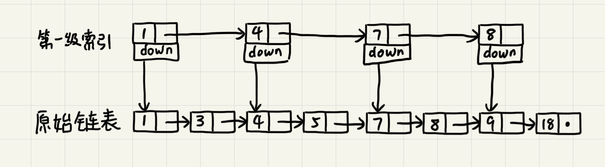
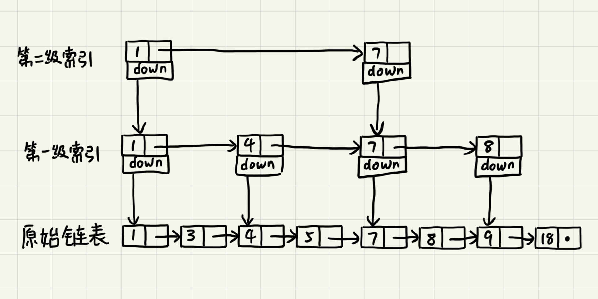

# 跳表

通常情况下，二分查找依赖数组实现。但是只要我们对链表稍加改造，就可以支持类似“二分”的查找算法。这就是跳表，一种各个方面性能都比较优秀的动态数据结构，可以支持快速地插入、删除、查找操作，写起来也不复杂（作者原文是这么说的...），甚至可以替代红黑树。

## 如何理解“跳表”？

对于单链表来说，即便其中的数据是有序的，查找元素的时间复杂度也是`O(n)`。如果像图中那样对链表建立以及“索引”，查找起来相比原来的`O(n)`就快了一些，至少不用遍历那么多的节点。新建立的这一层叫做`索引`或`索引层`。

在这个基础上再建立一级索引，查找所需遍历的节点进一步减少。

当链表较长的时候，比如说有1000、10000个节点。在构建索引后就可以以很高的效率执行查找。

## 时间复杂度

按上面图中的模式，每两个节点在上层建立一个索引节点。那么第一级索引约有n/2个节点，二级索引有n/4个节点...。以此类推第`k`级索引的节点个数为第`k-1`级索引的`1/2`，那第`k`级索引的节点个数就是`n/(2^k)`。

假设有`h`级索引，最高级索引有2个节点，原始链表有`n`个节点。可以求得`h=logn-1`（`logn`代指以2为底n的对数），包含最底层的整个跳表高度就是`logn`。如果在查找时，每一层都要遍历`m`个节点，那么跳表的查询时间复杂度就是`O(m*logn)`。

在这个例子中，最多只需要遍历最顶层的3个节点就能确定搜索数据在下一层所在的范围。也就是*顶层索引的两个节点所指向的两个下层索引节点*所形成的区间，而这个区间有3个节点。同样地，根据二层索引的三个节点可以确定数据在三层索引中的范围。因此这里`m=3`。查找的时间复杂度就是`O(3*logn)`。`m=3`的情况下，25级索引（七十多次比较）就可以在几千万个节点的有序链表中执行快速查找。

## 空间复杂度

比起单链表，跳表需要存储多级索引。本例中按照`n/2`，`n/4`，`n/8`...是一个等比数列，因此空间复杂度为`O(n)`。如果将`m=3`提高到`m=4`，虽然空间复杂度还是`O(n)`，但是实际使用空间为之前的1/2。在实际使用中，底层链表存储的经常为很大的对象，而索引层存储的时指针，额外消耗的空间占比并没有那么大。

## 动态操作

增加和删除单个节点对于链表来说是`O(1)`的操作，但增加和删除之前需要先执行查询。因此，跳表的增删时间复杂度均为`O(logn)`。

需要注意的是，在反复增删之后，有可能会出现索引指向的底层链表区间中的元素个数差距很大的情况，极端情况下甚至会退化成单链表。为了解决这个问题，增删节点的时候要更新对应的索引。在新增数据的时候，经常需要先用随机函数计算所需要更新的索引来平衡跳表索引大小和数据大小从而保证跳表的性能。

