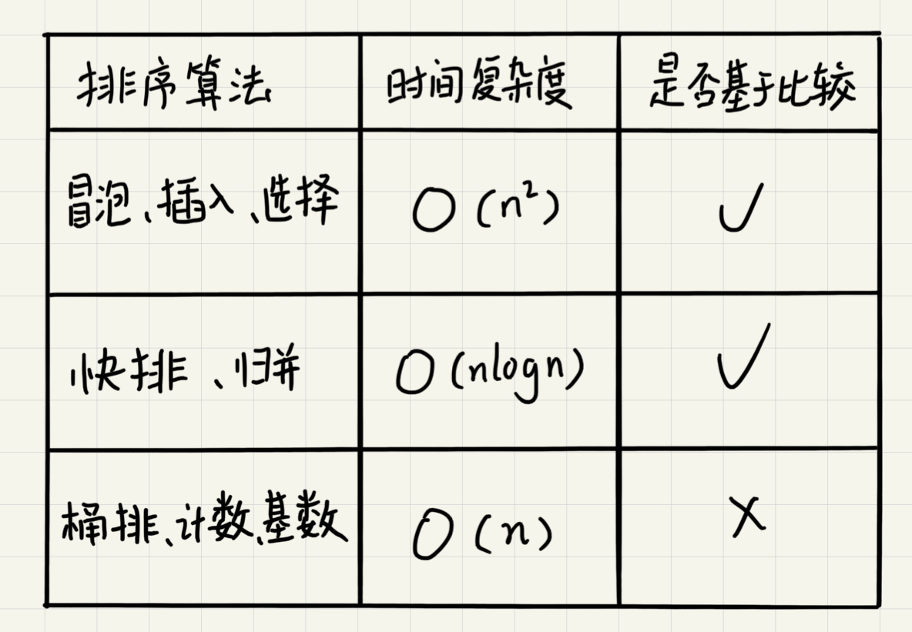
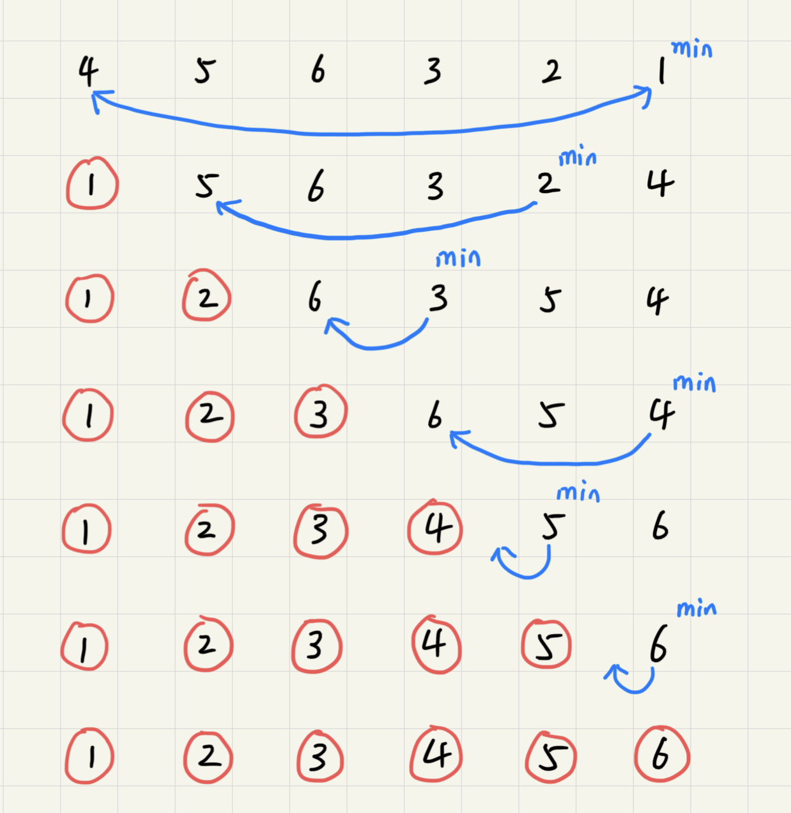
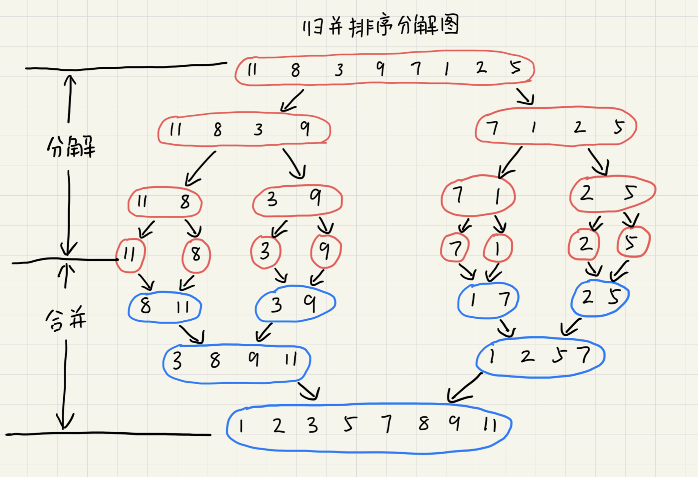
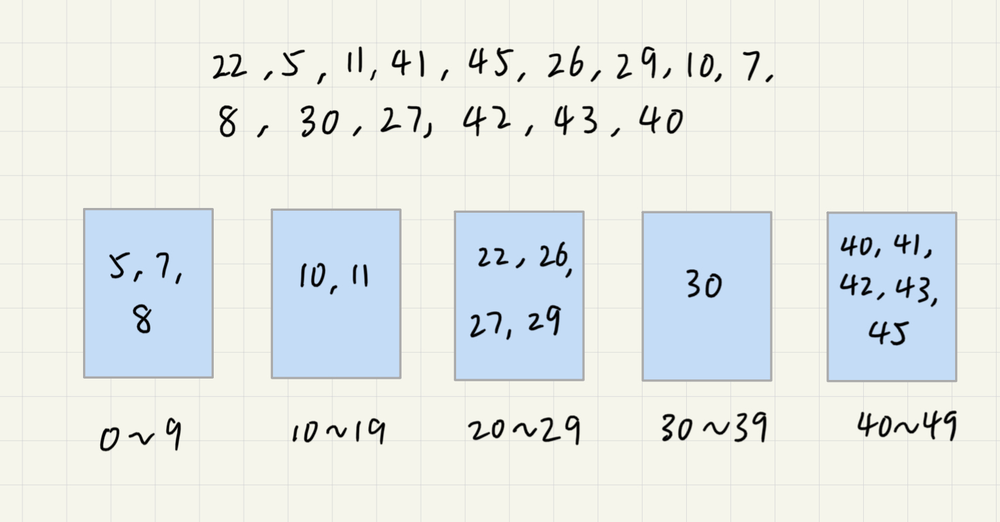

# 排序

按照时间复杂度，常用的算法可以简单分为以下三类。



## 分析排序算法

### 排序算法的执行效率

1. 最好的情况、最坏情况、平均情况时间复杂度

    在分析时间复杂度时，要分别给出`最好情况`、`最坏情况`、`平均状况`下的时间复杂度以及这些时间复杂度下要排序的数据是什么样的。

    之所以要分析这些指标，一是为了在各算法之间进行对比取舍，二是为了要得出算法在在不同数据下的性能表现。

2. 时间复杂度的系数、常数、低阶

    时间复杂度反映的是数据规模n很大的时候的一个增长趋势，所以表示的时候会忽略系数、常数、低阶。但是实际的软件开发中，排序的数据很可能是10个、100个、1000个这样规模很小的数据，所以在对同一阶时间复杂度的排序算法性能对比的时候就要把系数、常数、低阶也考虑进来。

3. 比较次数和交换（或移动）次数

    基于比较的排序算法的执行过程会涉及`比较大小`和`元素交换或移动`两种操作。在分析执行效率的时候应该把比较次数和交换（移动）次数也考虑进去。

### 内存消耗

排序算法的空间消耗也可以用空间复杂度来衡量。不过针对排序算法，还有一个`原地排序`的新概念。原地排序的算法，就是特指空间复杂度是`O(1)`的排序算法。

### 稳定性

仅仅用执行效率和内存消耗不足以衡量排序算法的好坏。还有一个重要指标，`稳定性`。这个概念是说，如果待排序的序列中存在值相等的元素，经过排序后，相等元素之间原有的先后顺序是否发生变化，变化了的算法是不稳定的，否则是稳定的。

## 冒泡排序

冒泡排序只会操作相邻的两个数据。每次冒泡操作都会对相邻的两个元素进行比较，看是否满足大小关系要求。如果不满足就让它们互换。一次冒泡会让至少一个元素移动到它应该在的位置，重复n次就完成了数据的排序工作。


可以看出，经过1次冒泡，元素`6`已经存储在正确的位置上了。要想完成所有数据的排序，只要进行6次这样的冒泡操作就行了。


当某次冒泡操作已经没有数据交换时，说明已经达到完全有序，不再需要进行后续的冒泡。


优化后的代码如下：

```Golang
func bubbleSort(nums []int, n int){
    if n <= 1 {
        return
    }

    for i:=0; i < n; i++ {
        flag := false
        for j:=0; j < n-i-1; j++ {
            if nums[j] > nums[j+1] {
                tmp := nums[j]
                nums[j] = nums[j+1]
                nums[j+1] = tmp
                flag = true
            }
        }
        if !flag {
            break
        }
    }
}
```

### 算法分析

1. 冒泡排序是原地排序算法吗？

    冒泡过程只涉及相邻数据的交换操作，只需要常量级的临时空间，所以空间复杂度为`O(1)`，是一个原地排序算法。

2. 冒泡排序是稳定的排序算法吗？

    在冒泡排序中，只有交换才可以改变两个元素的前后顺序。为了保证冒泡排序的的稳定性，当有相邻两个相等大小的元素时不做交换，所以冒泡排序是稳定的。

3. 冒泡排序的时间复杂度是多少？

    在数据有序的情况下只需要一次遍历，时间复杂度为`O(n)`。最坏情况下数据倒序排列，需要进行n次冒泡，时间复杂度为`O(n^2)`。

    平均时间复杂度，原文的分析很长很多，这里简要概括。通过数据的`有序度`和`逆序度`来分析。有序度指数组中具有有序关系的元素的对的个数，逆序度则相反。一个完全有序的数组任意两个元素都是有序的，数组在`满有序度`的状态。

    排序的过程就是增加有序度减少逆序度的过程。冒泡排序每次交换会使逆序度减1，有序度加1，因此`交换次数=逆序度`。取中间值逆序度为`n*(n-1)/4`，计算得出平均的时间复杂度也是`O(n^2)`。

## 插入排序

将数组中的数据分为两个区间，已排序区间和未排序区间。初始已排序区间只有一个元素，就是数组的第一个元素。插入算法的核心思想是取未排序区间中的元素和已排序区间中的元素一一对比，插入到合适的位置保证已排序区间内的元素依旧有序。重复此过程直到未排序区间为空。


插入排序也包含元素比较和移动两个操作。对于不同的查找插入点方法（从头到尾、从尾到头），元素的比较次数是有区别的，但移动次数总是固定的，也等于逆序度。如图中数组`满有序度=n*(n-1)/2=15`，初始有序度为5，因此逆序度为`15-5=10`，代码实现如下。

```Golang
func insertionSort(nums []int, n int){
    if n <= 1 {
        return
    }

    for i:=1; i < n; i++ {
        value := nums[i]
        j := i - 1
        for ; j >= 0; j-- {
            if nums[j] > value {
                nums[j+1] = nums[j]
            } else {
                break
            }
        }
        nums[j+1] = value
    }
}
```

### 算法分析

1. 插入排序是原地排序算法吗？

    插入排序算法并不需要额外的存储空间，所以空间复杂度是`O(1)`，是原地排序算法。

2. 插入排序是稳定的排序算法吗？

    在插入的时候，我们可以将后出现的元素插入到前面等值元素的后面来保证稳定性。所以插入排序是稳定的。

3. 插入排序的时间复杂度是多少？

    最好情况下数组有序，插入排序只需从头到尾遍历一次数组，时间复杂度为`O(n)`。最差情况下数组是倒序的，每次插入都相当于在数组的第一个位置插入一个数据，需要移动整个已排序区间，所以时间复杂度是`O(n^2)`。

    对于插入排序来说，每次插入操作都相当于在数组中插入一个数据，循环执行n次。而数组的插入操作平均时间复杂度为`O(n)`，所以插入排序平均时间复杂度为`O(n^2)`。

4. 为什么插入排序相比冒泡排序更受欢迎？

    前面的分析提到，冒泡排序的交换次数和插入排序的移动次数是固定的，等于数组的原始逆序度。但是从代码实现上看，冒泡排序需要3个赋值操作而插入排序只需要1个。

    ```Golang
    // 冒泡排序中的交换
    if a[j] > a[j+1] {
        tmp := a[j]
        a[j] = a[j+1]
        a[j+1] = tmp
    }

    // 插入排序中的移动
    if a[j] > value {
        a[j+1] = a[j]
    } else {
        break
    }
    ```

## 选择排序

选择排序的思路和插入排序类似，也分为已排序区间和未排序区间。但选择排序每次会从未排序区间中找到最小的元素放到已排序区间的末尾。



### 算法分析

1. 选择排序是原地排序算法吗？

    选择排序算法并不需要额外的存储空间，所以空间复杂度是`O(1)`，是原地排序算法。

2. 选择排序是稳定的排序算法吗？

    选择排序在数据交换中会破坏稳定性。如`5，8，5，2，9`这组数据，第一次交换`2`和`5`的时候会破坏两个`5`之间的前后关系。所以选择排序是不稳定的，相比前两者就逊色了不少。

3. 选择排序的时间复杂度是多少？

    任何数据分布情况下，选择排序都需要依次遍历`n`、`n-1`、`n-2`、...、`1`的数组元素，时间复杂度均为`O(n^2)`。

## 归并排序

归并排序使用的是`分治思想`。分治将一个大问题分解成子问题，子问题解决了大问题也就解决了。

归并排序将数组分为前后两部分，分别对前后两部分进行排序，然后再合并排序好的两部分从而最终达成整个数组的排序。



归并一般用递归实现，递归的递推公式和终止条件如下。

    递推公式：
    merge_sort(p...r) = merge(merge_sort(p...q), merge_sort(q+1...r))

    终止条件：
    q >= r 不用再继续分解

针对每一个区间，使用归并排序先将两个区间排序然后再合并。而当区间为空或只有1个数据（q >= r）的时候，此时的区间必定是有序的，可以返回上层进行合并，不再继续分解。

### 算法分析

1. 归并排序是稳定的排序算法吗？

    归并拍哦徐是否稳定取决于合并环节的实现。在合并过程中，对于两个相等的元素，我们可以将顺序靠前的区间中的那个元素先合并来保证算法的稳定性。因此，归并排序是稳定的。

2. 归并排序的时间复杂度是多少？

    由于归并采用了递归实现，我们可以将其时间消耗表示为`T(a) = T(b) + T(c) + K`。其中K为合并两个子问题所消耗的时间。

    假设对n个元素进行归并排序，需要的时间为`T(n)`。那么归并排序的时间复杂度计算公式如下

    ```
    T(1) = C;               n=1时区间有序，只耗费常数级的时间
    T(n) = 2*T(n/2) + n;    n>1，合并需要做一次遍历因此需要加n

    T(n/2) = 2*T(n/4) + n/2;
    T(n) = 2*(2*T(n/4) + n/2) + n = (2^2)*T(n/4)+ 2*n;

    T(n/4) = 2*T(n/8) + n/4;
    T(n) = (2^2)*(2*T(n/8) + n/4)+ 2*n = (2^3)*T(n/8)+ 3*n;

    ...
    T(n) = (2^k)*T(n/(2^k))+ k*n
    其中 k = logn
    T(n) = n*T(1)+ logn*n = C*n + n*logn
    ```

    此外，归并排序还与数组的数据分布无关。因此归并排序的最好、最坏、平均时间复杂度均为`O(n*logn)`。

3. 归并排序是原地排序算法吗？

    不是，因为每次合并的时候都需要开辟等同于那个区间大小的临时空间来进行合并操作。而最大的区间等同于整个数组本身，所以归并排序并不是原地排序算法，它的空间复杂度是`O(n)`。

## 快速排序

快速排序使用的也是分治的思想。对于数组中用下标`l`和`r`圈出的待排序区间，从中选出一个数作为分区点（pivot）。然后遍历这个区间，将小于pivot的元素放到左边，将大于等于pivot的数放到右边，将pivot放在中间。循环往复直到数组完成排序。

同样，快排也是用递归实现的，它的递推公式和终止条件如下。

```
递推公式:
quick_sort(l...r) = quick_sort(l...p-1) + quick_sort(p+1...r)

终止条件:
l >= r
```

`l >= r`时区间为空或只有一个元素，这时候这个区间必定是已经完成排序的，不需要在进行递归。归并排序平均地分割两个区间，然后用merge合并。而快速排序则用partition函数按pivot分割成两个区间然后递归排序，不需要合并。

### 算法分析

1. 与归并排序的区别

    
    
    由上图可以发现，归并排序**由下到上**先处理子问题然后再合并。而快速排序**由上到下**先分区，再处理子问题，两者恰好相反。

2. 快速排序是原地排序算法吗？

    快速排序是否是原地排序算法取决于partitiion函数如何完成分割。如果partition函数申请了额外的空间用于保存左右两个区间，那么其空间复杂度为O(n)。但实际上partition一般采取数据交换的方式来完成原地分区。其策略如图。

    

    这时候，快速排序所需的额外空间为为常数级，空间复杂度是`O(n)`，是一个原地排序算法。

3. 快速排序的时间复杂度是多少？

    在理想的数据分布情况下，快速排序能将区间一分为二，此时的时间复杂度等于归并排序的时间复杂度，为`O(n*logn)`。

    在极端情况下，数据分区后只存在于pivot的其中一端，这个时候时间复杂度将退化为`O(n^2)`。

    平均时间复杂度为`O(n*logn)`，过于复杂，后续补充。

4. 快速排序是稳定的排序算法吗？

    同选择排序一样，快速排序在交换数据后会破坏数据原有的顺序，因此快速排序是不稳定的。

## 线性排序

线性排序指的是那些排序时间复杂度为`O(n)`的排序算法。之所以能做到线性的时间复杂度，主要原因是这些算法不是基于比较的排序算法，都不涉及元素之间的比较操作。

### 桶排序

顾名思义，桶排序会用到“桶”，核心思想是将要排序的数据分到几个有序的桶里，每个桶里的数据再单独进行排序。桶内排完序之后，再把每个桶里的数据按照顺序依次取出，组成的序列就是有序的了。



如果要排序的数据有`n`个，我们把它们均匀地划分到`m`个桶内，每个桶里就有`k=n/m`个元素。每个桶里使用快速排序，时间复杂度为`O(k*logk)`。`m`个桶排序的时间复杂度就是`O(m*k*logk)`，因为`k=n/m`，所以整个桶排序的时间复杂度就是`O(n*log(n/m))`。当桶的个数`m`接近数据个数`n`时，`log(n/m)`就是一个非常小的常量，这个时候桶排序的时间复杂度接近`O(n)`。

也就是说只有当数据分布均匀（每个桶里的数据个数差不多）且桶的个数接近数据个数（每个桶内的数据不多，最好接近2个）的时候时间复杂度才接近`O(n)`。桶间数据数量差距越大，桶内数据相比2差距越多，时间复杂度差`O(n)`越高。

**桶排序比较适合在外部排序中**。所谓的外部排序就是数据存储在外部磁盘中，数据量比较大，内存有限，无法将数据全部加载到内存中。

比如说有10GB的订单数据，我们希望按订单金额进行排序，但是我们的内存有限，只有几百MB，没办法一次性把10GB的数据都加载到内存中。这个时候就可以借助桶排序的处理思想来解决这个问题。

我们可以先扫描一遍文件，看订单金额所处的数据范围。假设经过扫描之后我们得到，订单金额最小1元，最大是10万元。我们将所有订单根据金额划分到100个桶里，第一个桶我们存储金额在1元到1000元之内的订单，第二桶存储金额在1001元到2000元之内的订单，依次类推。每一个桶对应一个文件，并且按照金额范围的大小顺序编号命名(00，01，02...99)。

理想情况下，如果订单金额在1到10万之间均匀分布，那么订单会被均匀分到100个文件中，每个小文件中存储大约100MB的订单数据，我们就是可以将100个小文件依次放到内存中，用快速排序来排序。等所有文件都排好序之后我们就按照文件编号依次将数据写到一个文件中。如果数据分布不均匀，可对较大的部分进行再次划分。

### 计数排序

类比桶排序，当要排序的n个数据所处范围并不大的时候，比如最大值为k，我们就可以把数据划分成k个桶。每个人桶内数据值都是相等的，省掉了桶内排序的时间。

假设待排序数组`A[8]`中有数据`2，5，3，0，2，3，0，3`。我们可以得到一个代表数据范围的数组`C[6]`表示数组`A[8]`的数据范围为`0~5`，有6种不同的元素。

`C[6]`中的数据为`2，0，2，3，0，1`，表示`A[8]`中有2个0，0个1，2个2，3个3，0个4，1个5。依次，我们可以对数组`C[6]`求和，改写为`2，2，4，7，7，8`。改写后的`C[6]`表示`A[8]`中小于等于0的数据有2个，小于等于1的数据有2个，小于等于2的数据有4个，小于等于3的数据有7个...。

然后从后往前依次扫描数组`A[8]`（为什么要从后往前？）。比如当取到数字3，再从数组`C[6]`取出`C[3]=7`（也就是说目前数组`A[8]`中小于等于3的数有7个），将`A[8]`取出的数字3放到已排序数组的`R[8]`中的第7位（下标6的位置）。这之后再把`C[6]`中下标3里的7减到6，表示`A[8]`中的一个3排到`R[8]`后`A[8]`中剩余的小于等于3的数据个数还有6个。循环往复直到所有数据排序完成。


计数排序只能用在数据范围不大的场景中，如果数据范围k比要排序的数据n大很多，就不适合用计数排序了。而且，计数排序只能给非负整数排序，如果要排序的数据是其他类型的，要将其在不改变相对大小的情况下转化为非负整数。

### 基数排序


这里按照每位来排序的排序算法要是稳定的，否则这个实现思路就是不正确的。因为如果是非稳定排序算法，那最后一次排序只会考虑最高位的大小顺序，完全不管其他位的大小关系，那么低位的排序就完全没有意义了。

而针对每一位的排序，可以用桶排序和计数排序来达到`O(n)`的时间复杂度。如果要排序的数据有k位，那其时间复杂度为`O(n*k)`，如果要排序的是手机号码，那其时间复杂度就是线性的`O(11*n)=O(n)`。

基数排序对要排序的数据是有要求的，需要可以分割出独立的“位”来比较，而且位之间有递进的关系，如果a数据的高位比b数据大，那剩下的低位就不用比较了。除此之外，每一位的数据范围不能太大，要可以用线性排序算法来排序，否则，基数排序的时间复杂度就无法做到`O(n)`了。

## 必知必会

实现归并排序、快速排序、插入排序、冒泡排序、选择排序

实现在`O(n)`的时间复杂度内找到一组数据的第k大的元素
