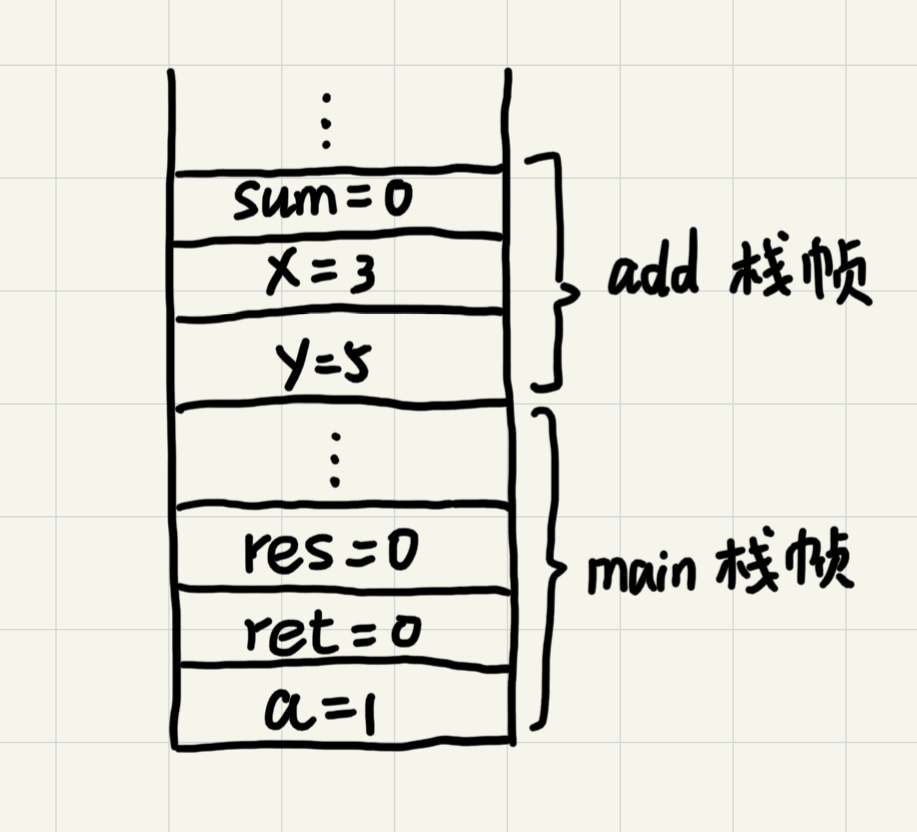
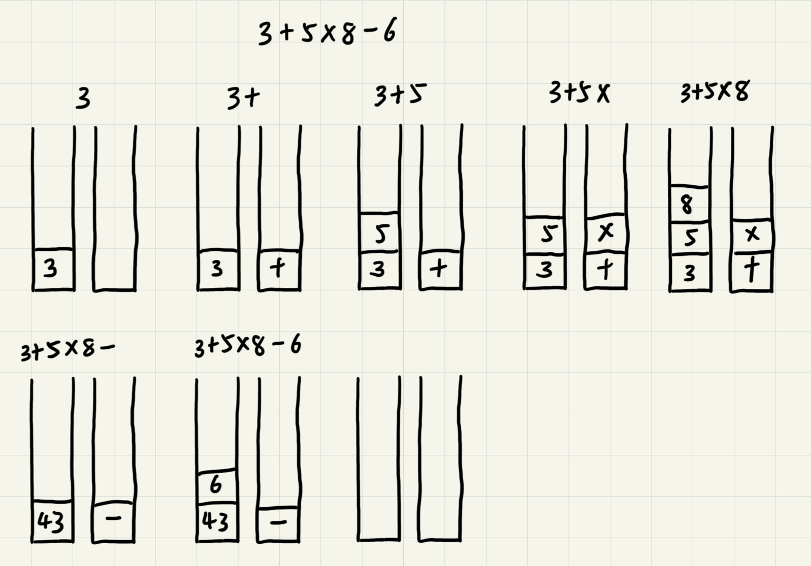

# 栈

后进者先出，先进者后出，这就是典型的“栈”结构。

从栈的操作特性上来看，栈是一种“操作受限”的线性表，只允许在一端插入和删除数据。

## 如何实现一个“栈”

栈可以用数组实现，也可以用链表实现。用数组实现的叫**顺序栈**，用链表实现的**链式栈**。

```GO
// 基于数组实现的顺序栈
type ArrayStack struct {
	items []string // 数组
	count int      // 栈中元素个数
	n     int      // 栈的大小
}

func NewArrayStack(capacity int) *ArrayStack {
	return &ArrayStack{
		items: make([]string, capacity),
		count: 0,
		n:     capacity,
	}
}

// 入栈
func (s *ArrayStack) Push(item string) bool {
	// 数组空间不够，入栈失败
	if s.count >= s.n {
		return false
	}
	// 将item放到下标为count的位置，并且count加一
	s.items[s.count] = item
	s.count++
	return true
}

// 出栈
func (s *ArrayStack) Pop() string {
	// 栈为空
	if s.count == 0 {
		return ""
	}
	// 返回下标为count-1的数组元素，并且栈中元素个数count减一
	s.count--
	return s.items[s.count]
}
```

不管是顺序栈还是链式栈，存储数据只需要大小为n的存储空间。在入栈和出栈过程中，只需要一两个临时变量存储空间，所以空间复杂度是O(1)。不管是顺序栈还是链式栈，入栈、出栈只涉及栈顶个别数据的操作，所以时间复杂度都是O(1)。

## 栈在函数调用中的应用

操作系统给每个线程分配一块独立的内存空间，这块内存被组织成“栈”这种结构，用来存储函数调用时的临时变量。每进入一个函数，就会将临时变量作为一个栈帧入栈，当被调用函数执行完成，返回之后，将这个函数对应的栈帧出栈。

```c
int main() {
    int a = 1;
    int ret = 0;
    int res = 0;
    ret = add(3, 5);
    res = a + ret;
    printf("%d\n", res);
    return 0;
}

int add(int x, int y) {
    int sum = 0;
    sum = x + y;
    return sum;
}
```

从代码中看出，main()函数调用了add()函数获取计算结果并且与临时变量a相加，最后打印res的值。



## 栈在表达式求值中的应用

编译器利用两个栈来实现表达式求值。其中一个栈保存操作数，另一个保存运算符。从左向右遍历表达式，遇到数字时压入栈中；遇到运算符就与运算符栈的栈顶元素进行比较。如果比运算符栈顶元素的优先级高，将当前运算符压入栈中，否则取出栈顶运算符，从操作数栈的栈顶取2个操作数进行计算，再把计算完的结果压入操作数栈，之后继续下一轮比较。



## 栈在括号匹配中的应用

假设表达式中只包含三种括号，圆括号`()`、方括号`[]`和花括号`{}`，并且它们可以任意嵌套。

用一个栈来存储未匹配的左括号，从左到右依次扫描字符串。当扫描到左括号时将其压入栈中；当扫描到右括号时，从栈顶取出一个左括号。如果能够匹配，则继续下一轮压栈匹配，否则表示匹配不了，表达式非法。

## 必知必会

用数组实现一个顺序栈

用链表实现一个链式栈

模拟浏览器的前进、后退功能

